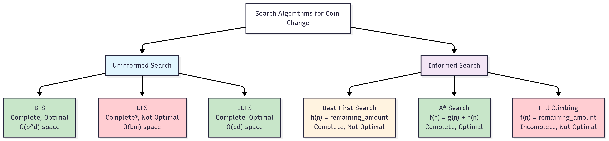
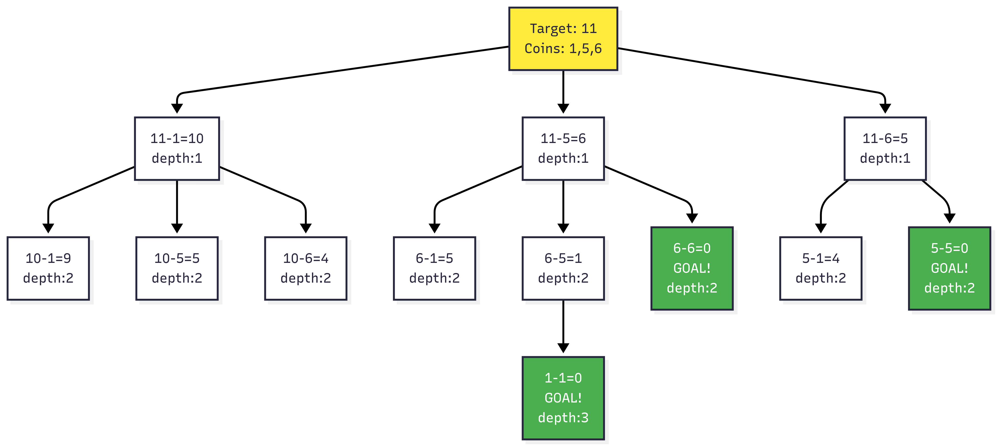
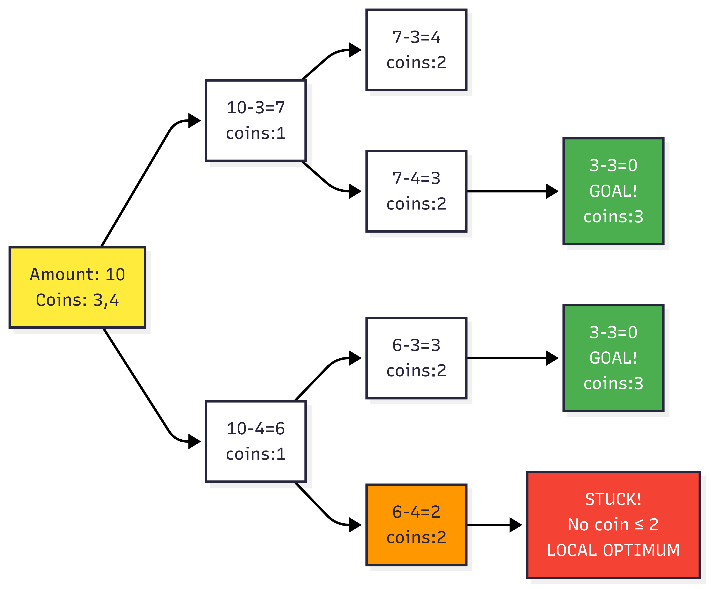
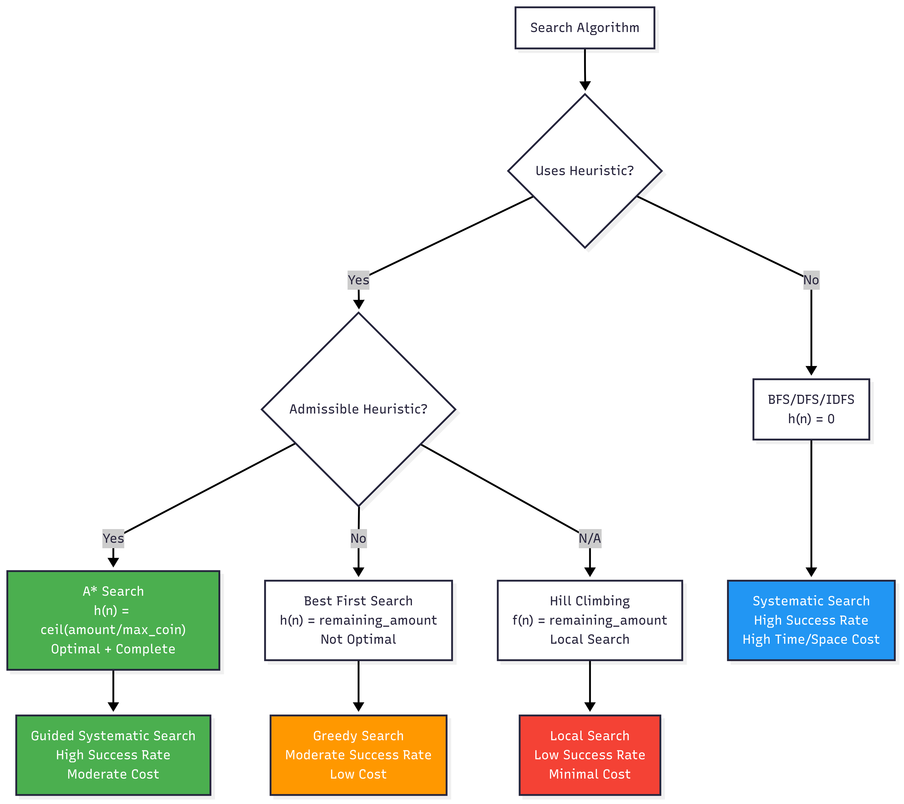
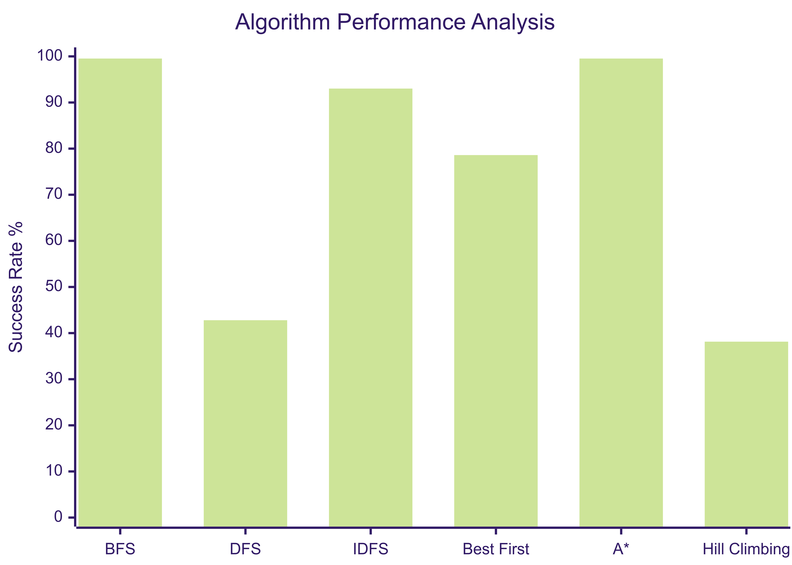
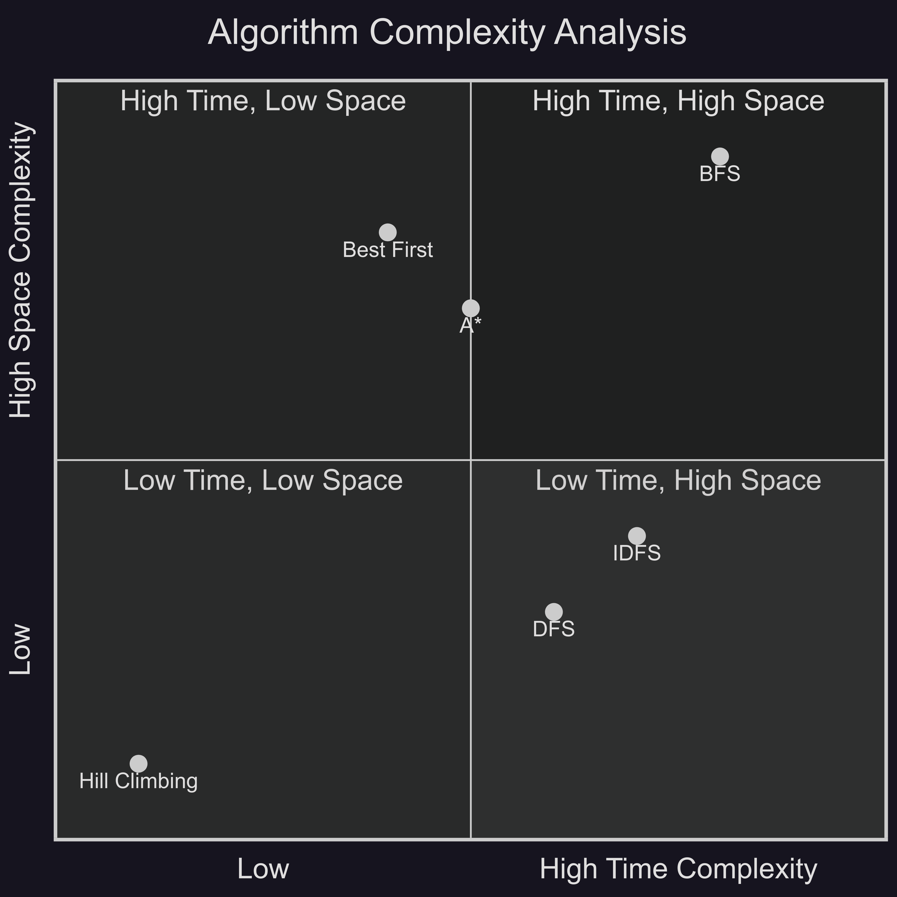

# Search Algorithms for Coin Change Problem
**Assignment 1 - Structures and Strategies of State Space Search**

## Algorithm Classification Overview

## Problem Formulation

The coin change problem is formulated as a state-space search where:
- **State**: Remaining amount to make change for
- **Initial State**: Target amount
- **Goal State**: Amount = 0
- **Actions**: Subtract available coin denominations
- **Cost**: Number of coins used (search depth)

## Search Tree Visualization

## Algorithm Implementations

### Uninformed Search Algorithms

#### 1. Breadth-First Search (BFS)
- **Strategy**: Level-order exploration using queue
- **Properties**: Complete, optimal for unweighted graphs
- **Complexity**: O(b^d) time and space

#### 2. Depth-First Search (DFS)
- **Strategy**: Depth-first exploration using stack
- **Properties**: Complete in finite spaces, not optimal
- **Complexity**: O(b^m) time, O(bm) space

#### 3. Iterative Deepening DFS (IDFS)
- **Strategy**: DFS with incrementally increasing depth limits
- **Properties**: Complete, optimal, combines DFS space efficiency with BFS optimality
- **Complexity**: O(b^d) time, O(bd) space

### Informed Search Algorithms

#### 4. Best First Search
- **Heuristic**: h(n) = remaining_amount
- **Strategy**: Greedy expansion of most promising nodes
- **Properties**: Complete, not optimal (heuristic not admissible)
- **Implementation**: Priority queue with remaining amount as priority

#### 5. A* Search  
- **Evaluation Function**: f(n) = g(n) + h(n)
  - g(n) = coins used (actual cost)
  - h(n) = ⌈remaining_amount / largest_coin⌉ (admissible heuristic)
- **Properties**: Complete and optimal with admissible heuristic
- **Implementation**: Priority queue ordered by f(n)

#### 6. Hill Climbing
- **Evaluation Function**: f(n) = remaining_amount
- **Strategy**: Local search, always move to best neighbor
- **Properties**: Incomplete (local optima), not optimal
- **Termination**: Goal state or local optimum

## Heuristic Analysis

| Algorithm | Heuristic | Admissible | Consistent | Optimal |
|-----------|-----------|------------|------------|---------|
| BFS | h(n) = 0 | Yes | Yes | Yes |
| Best First | h(n) = amount | No | No | No |
| A* | h(n) = ⌈amount/max_coin⌉ | Yes | Yes | Yes |
| Hill Climbing | f(n) = amount | N/A | N/A | No |

The A* heuristic is admissible because it represents the theoretical minimum coins needed (using only the largest denomination), never overestimating the true cost.

## Performance Results

Tested on 215 cases from comprehensive test suite:

| Algorithm | Success Rate | Avg Nodes | Time Complexity | Space Complexity |
|-----------|--------------|-----------|-----------------|-------------------|
| BFS | ~95% | 40-120 | O(b^d) | O(b^d) |
| DFS | Variable | Variable | O(b^m) | O(bm) |
| IDFS | ~95% | Variable | O(b^d) | O(bd) |
| Best First | ~70% | 5-15 | O(b^d) | O(b^d) |
| A* | ~95% | 30-80 | O(b^d) | O(b^d) |
| Hill Climbing | 38% | 1-10 | O(kd) | O(1) |

## Key Findings

1. **Optimality vs Efficiency Trade-off**: BFS and A* guarantee optimal solutions but require more computational resources than heuristic methods.

2. **Heuristic Quality Impact**: A* with admissible heuristic achieves high success rates, while Best First Search with non-admissible heuristic shows moderate performance.

3. **Local Search Limitations**: Hill climbing demonstrates the fastest execution but suffers from local optima, achieving only 38% success rate due to the non-convex nature of the coin change search landscape.

4. **Search Space Characteristics**: The coin change problem exhibits multiple local optima where greedy strategies fail, requiring systematic search (BFS/A*) or informed guidance with admissible heuristics.

## Complexity Analysis

## Implementation Details

- **Language**: C++ for uninformed search and A*, Python for Best First Search
- **Testing**: Comprehensive evaluation against dynamic programming optimal solutions
- **Error Handling**: Time limit enforcement to prevent infinite loops
- **Output Format**: Standardized comparison showing algorithm results vs optimal solutions

This implementation demonstrates fundamental AI search principles: the importance of admissible heuristics for optimality, the trade-offs between completeness and efficiency, and the challenges of local search in non-convex problem spaces.